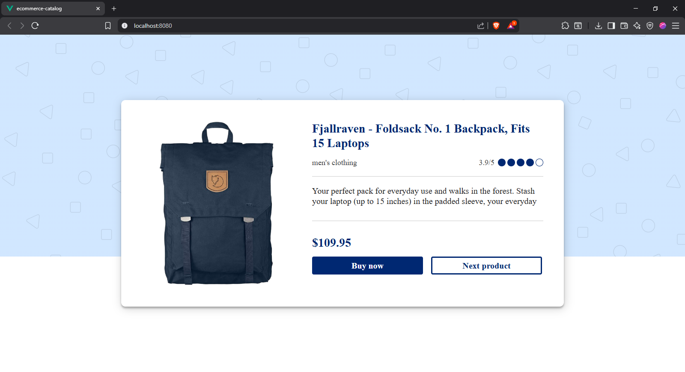
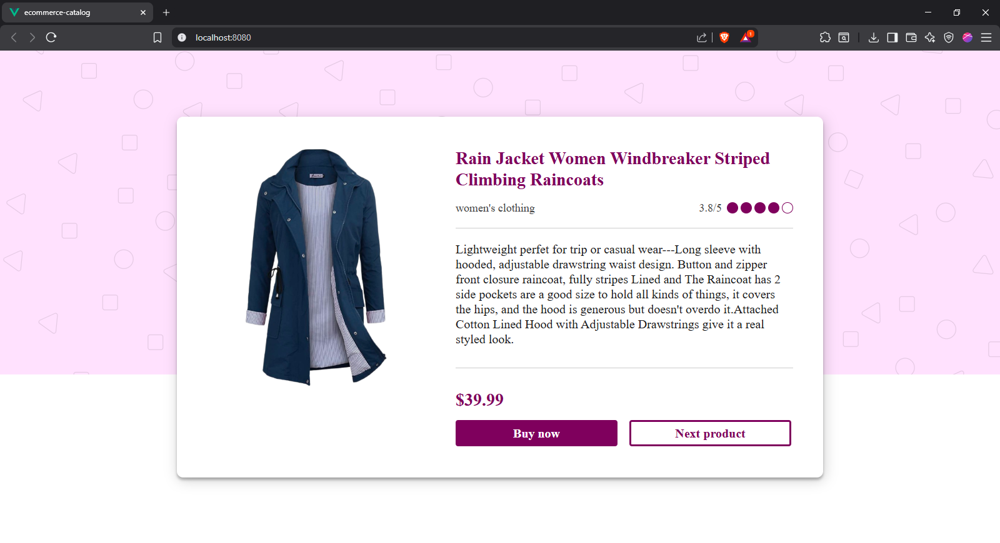
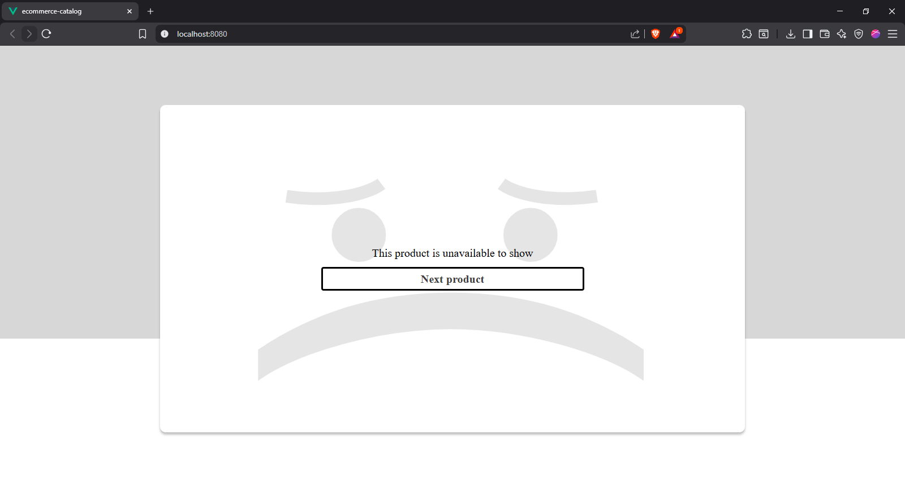

# E-Commerce Catalog

Virtual Internship Experience - Front End Developer at Core Initiative

## 📋 Project Description

A dynamic e-commerce product catalog built with Vue.js 2 that fetches real-time data from FakeStore API and displays products with three distinct UI designs based on category.

## ✨ Features

- **Dynamic Product Display**: Real-time API data fetching
- **Category Filtering**: Automatically filters men's and women's clothing
- **3 Design States**:
  - Men's Clothing (Blue Theme)
  - Women's Clothing (Pink Theme)
  - Unavailable Products (Gray Theme with Sad Face)
- **Loading State**: Spinner animation for better UX
- **Responsive Design**: Adapts to different screen sizes

## 🛠️ Tech Stack

- Vue.js 2
- Vanilla CSS (CSS Variables)
- FakeStore API
- Git & GitHub

## 📁 Project Structure
```
ecommerce-catalog/
├── src/
│   ├── assets/
│   │   ├── images/
│   │   │   ├── pattern-shapes.svg
│   │   │   └── sad-face.svg
│   │   └── style/
│   │       └── page.css
│   ├── components/
│   │   └── ProductDisplay.vue
│   ├── App.vue
│   └── main.js
├── public/
├── package.json
└── README.md
```

## 🚀 Installation & Setup

1. **Clone the repository**
```bash
git clone https://github.com/fakrl/ecommerce-catalog.git
cd ecommerce-catalog
```

2. **Install dependencies**
```bash
npm install
```

3. **Run development server**
```bash
npm run serve
```

4. **Build for production**
```bash
npm run build
```

## 🎨 Design System

### Color Palette
- **Navy Blue** (#002772) - Men's section
- **Magenta** (#720060) - Women's section
- **Light Blue** (#D6E6FF) - Men's background
- **Light Pink** (#FDE2FF) - Women's background
- **Light Gray** (#DCDCDC) - Unavailable background

### Components
- Product Card (Men & Women)
- Unavailable Card
- Loading Spinner
- Action Buttons

## 📡 API Integration

**Endpoint:** `https://fakestoreapi.com/products/{index}`

**Filter Logic:**
- Only displays `men's clothing` and `women's clothing`
- Other categories show "unavailable" state
- Auto-increment index (1-20) on "Next Product" click

## 🖥️ Demo

[Live Demo Link] (if deployed)

## 📸 Screenshots

### Men's Clothing


### Women's Clothing


### Unavailable Product


## 👨‍💻 Author

**fakrul**
- GitHub: fakrl (https://github.com/fakrl)
- LinkedIn: Fakhrul Mukhlisin (https://linkedin.com/in/fakrl)

## 📝 License

This project is part of Core Initiative Virtual Internship Experience.

## 🙏 Acknowledgments

- Core Initiative for the internship opportunity
- FakeStore API for providing the product data
- Figma design team for the UI/UX design
